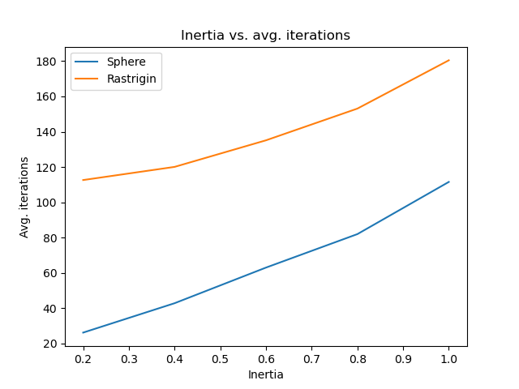
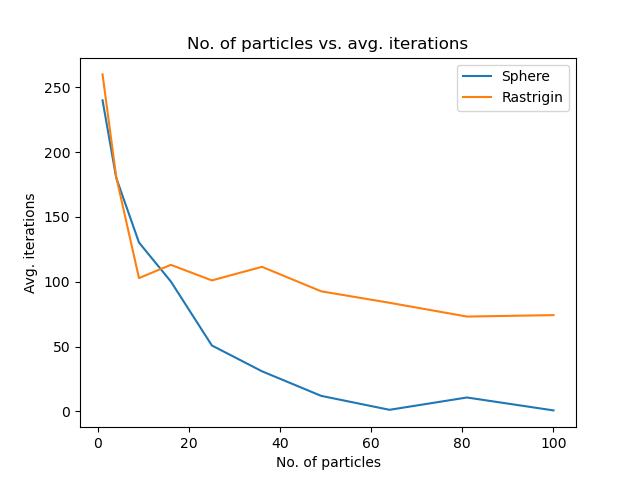
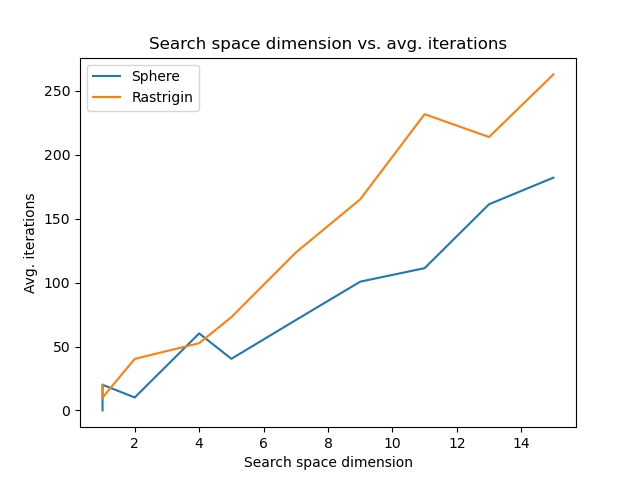
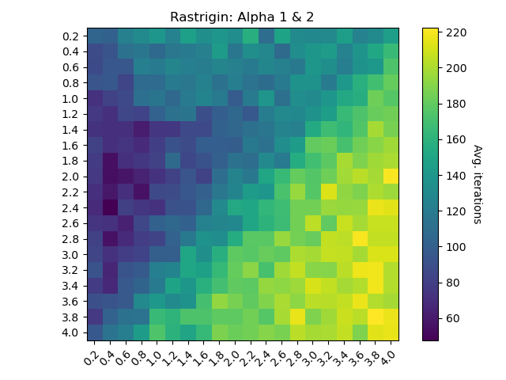

# Natural Computing

Some code snippets from an assignment for the course [Natural Computing](http://www.drps.ed.ac.uk/21-22/dpt/cxinfr11161.htm) at [The University of Edinburgh](https://www.ed.ac.uk/informatics).
This assignment achieved the highest mark in a class of ~100 students.

## Particle Swarm Optimisation

Implemented the Particle Swarm Optimisation (PSO) [1] algorithm from scratch using NumPy, and experimented with different parameters such as inertia, number of particles, search space dimension, etc.
Some example graphs are below.
In Figure 4 y-axis: alpha 1, x-axis: alpha 2.

 
 

## Genetic Program

Implemented the Genetic Program (GP) [2] algorithm from scratch using NumPy.
The basics followed the book *A Field Guide to Genetic Programming* [3], but the questions in the assignment required much beyond this.
`GeneticProgram.py` is capable of solving advanced symbolic regression problems of around 5 depth (63 nodes) with 16 functions and 9 terminals, the upper estimate of the number of possible solutions being 16^31 * 9^32 ≈ 7*10^67.
The basics and key ideas are outlined below.

### Basics

- The population is initialised with the ramped half-and-half method, a combination of the full and grow methods. The population can also be initialised with a seed.
- Crossover is biased to ensure that sufficient genetic material is transferred and similar sized trees are produced as offspring. Program 1’s crossover point cannot be the root node (as its parent forms part of the offspring) and is two times more likely to be depth n − 1 than n. Program 2’s crossover point is equally likely to be on any depth, although a depth n − 1 node is twice as likely to be selected as a depth n node (because, on average, there are two times more nodes in depth n than n − 1).
- Four different types of mutation are possible: shrink, hoist, grow, and point.
- Selection can be either fitness proportionate or tournament selection, and elitism can be used.
- Max depth is enforced by a method that prunes program trees.

### Key Ideas

- **Hill climbing routine:** hill climbing with genetic programming characteristics. After selection, recombination, and mutation; the routine traverses the program trees in the same way the mutation routine does, and with some probability applies hill climbing to a node. Each possible mutation: a random shrink, a hoist, a random grow, and every possible point mutation is applied to the node. The change in loss is calculated, and if there are multiple better options, an option is chosen with a probability proportional to its improvement.
- **Keeping track of the best individuals:** the best unique individuals were saved, and seeded into every other major iteration for the first few iterations, and every iteration past that. This important idea ensured that the program could only ever get better, and allowed for the population to be regenerated without fear of losing progress, which in turn promoted diversity.
- **Adding constraints to functions and probabilities to terminals and functions:** the program was set up in such a way that allowed constraints to be applied to functions, e.g. sin could not have a cos as a child, and the probability that x is chosen as a terminal is 25%. This significantly reduced the search space, thus reducing the number of undesirable and unlikely functions, and speeding the algorithm up overall.

## References

[1] J. Kennedy and R. Eberhart, "Particle swarm optimization," Proceedings of ICNN'95 - International Conference on Neural Networks, 1995, pp. 1942-1948 vol.4, doi: 10.1109/ICNN.1995.488968.

[2] Nichael Lynn Cramer, "A representation for the Adaptive Generation of Simple Sequential Programs", Proceedings of an International Conference on Genetic Algorithms and the Applications, 1985.

[3] Riccardo Poli and William B. Langdon and Nicholas Freitag McPhee, "A field guide to genetic programming", Published via http://lulu.com and freely available at http://www.gp-field-guide.org.uk, 2008.
